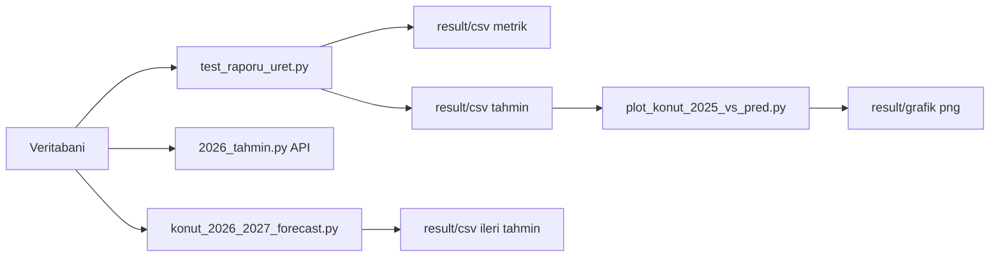
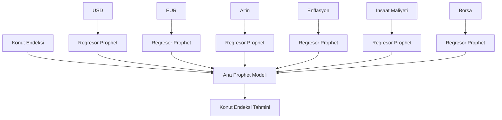

# Konut Endeksi Tahmin Projesi

Bu proje, bolge bazli konut endeksi tahmini uretmek, gecmis yillarda model performansini test etmek ve ileri donem tahminlerini raporlamak icin hazirlanmistir.

Proje 3 ana amaca hizmet eder:

- API uzerinden dinamik tahmin uretmek
- Belirli bir yil icin backtest / performans analizi yapmak
- CSV ve grafik ciktilari ile yonetsel raporlama hazirlamak

## Hizli Baslangic

Projeyi ilk kez kullanacak biri icin en kisa akıs:

1. `.env.example` dosyasindan `.env` olustur.
2. Veritabani bilgilerini `.env` icine yaz.
3. `python kod/test_raporu_uret.py` ile test CSV'lerini uret.
4. `python kod/plot_konut_2025_vs_pred.py` ile grafigi otomatik kaydet.
5. `python kod/konut_2026_2027_forecast.py` ile ileri tahmin tablosu uret.
6. API gerekiyorsa `python kod/2026_tahmin.py` ile servisi baslat.

Bu 6 adim sonunda elinde hem test metrikleri hem tahmin CSV'leri hem de sunumda kullanabilecegin grafik dosyalari olur.

## Gorsel Ozet

GitHub uzerinde README icinde dogrudan gorunen bir akis ozeti:



Model akisinin teknik ozeti:



## GitHub'da Gorsel Gosterimi

Gercek grafik PNG dosyalari repoya eklendiginde README icinde dogrudan gosterilebilir.

Onerilen gorsel dosya isimleri:

- `result/grafik/konut_2025_gercek_vs_tahmin_TP_KFE_TR10_M7_maliyet_enflasyon.png`
- `result/grafik/konut_2026_2027_trend_TP_KFE_TR10.png`

Paylasilmasinda sakinca olmayan PNG dosyalari varsa README'ye asagidaki formatla eklenebilir:

```md


```

Not:

- `plot_konut_2025_vs_pred.py` 2025 grafigini otomatik kaydeder.
- PNG dosyasini repoya dahil ettiginde GitHub bu gorseli otomatik gosterir.
- Kurumsal olarak paylasilmasi uygun olmayan gorseller repoya eklenmemelidir.

## Proje Yapisi

```text
trend_algoritması/
├─ kod/
│  ├─ config.py
│  ├─ 2026_tahmin.py
│  ├─ test_raporu_uret.py
│  ├─ konut_2026_2027_forecast.py
│  ├─ plot_konut_2025_vs_pred.py
│  ├─ veriTahmin.py
│  ├─ 2025gt.py
│  └─ model_metodolojisi.md
├─ result/
│  ├─ csv/
│  │  ├─ konut_test_metrik_*.csv
│  │  ├─ konut_test_tahminler_*.csv
│  │  ├─ konut_2026_2027_*.csv
│  │  └─ diger analiz ciktilari
│  └─ grafik/
│     └─ grafik ekran goruntuleri / png ciktilari
├─ .env.example
├─ .gitignore
└─ README.md
```

## `kod/` Klasoru

`kod/` altinda uygulamanin tum kaynak kodlari bulunur.

- `config.py`
  - ortam degiskenlerini okur
  - veritabani baglantisini kurar
  - generic tablo/kolon adlarini tutar
- `2026_tahmin.py`
  - FastAPI tabanli tahmin servisi
  - secilen bolge ve ay ufku icin konut tahmini uretir
- `test_raporu_uret.py`
  - secilen test yili icin model karsilastirmasi yapar
  - MAE, MAPE, RMSE gibi metrikler uretir
- `konut_2026_2027_forecast.py`
  - 2026 ve 2027 icin aylik ileri tahmin tablosu olusturur
- `plot_konut_2025_vs_pred.py`
  - 2025 gercek vs tahmin grafigini uretir
- `veriTahmin.py`
  - ornek finans / emtia tahmin analizi
- `2025gt.py`
  - 2025 odakli tekil Prophet test analizi
- `model_metodolojisi.md`
  - modelin teknik mantigini ve raporlama dilini aciklar

## `result/` Klasoru

Bu klasor, tum uretim ve raporlama ciktilarinin tek yerde toplanmasi icin kullanilir.

### `result/csv/`

CSV bazli raporlar burada tutulur.

Ornek dosyalar:

- `konut_test_metrik_TP_KFE_TR10.csv`
  - model bazli performans metrikleri
- `konut_test_tahminler_TP_KFE_TR10.csv`
  - tarih bazli gercek ve tahmin degerleri
- `konut_2026_2027_TP_KFE_TR10.csv`
  - ileri donem tahmin tablosu
- `borsa_2025_analiz_raporu_prophet.csv`
  - ornek finans analizi raporu

### `result/grafik/`

Bu klasor, grafik ciktilarini saklamak icin kullanilir.

Buraya asagidaki turde dosyalar koyulabilir:

- 2025 gercek vs tahmin grafik ekran goruntuleri
- 2026-2027 tahmin trend grafikleri
- sunum veya rapora eklenecek png/jpg dosyalari

Onerilen dosya isimleri:

- `konut_2025_gercek_vs_tahmin_TR10.png`
- `konut_2026_2027_trend_TR10.png`
- `model_karsilastirma_2025.png`

Not:

- `plot_konut_2025_vs_pred.py` artik olusturdugu grafigi otomatik olarak bu klasore kaydeder.
- Boylece ekran goruntusu alma zorunlulugu olmaz.

## Kurulum

1. Proje kokunde `.env.example` dosyasini kopyalayip `.env` olusturun.
2. `.env` icine kendi veritabani bilgileriniz yazin.
3. Gerekirse `kod/config.py` icindeki `DB_SCHEMA`, `TABLES` ve `COLUMNS` alanlarini kendi ortaminiza gore duzenleyin.

Ornek `.env`:

```env
DB_HOST=localhost
DB_PORT=5432
DB_NAME=postgres
DB_USER=postgres
DB_PASSWORD=your_password_here
```

## Teknik Yapi

Projede kullanilan temel bilesenler:

- `Python`: uygulama ve modelleme dili
- `pandas`: veri okuma, birlestirme ve tarih donusumleri
- `Prophet`: zaman serisi tahmin modeli
- `FastAPI`: tahmin servisini API olarak sunmak icin
- `Pydantic`: API istek dogrulamasi icin
- `SQLAlchemy` ve `pg8000`: PostgreSQL baglantisi icin
- `matplotlib`: gercek vs tahmin grafiklerini uretmek icin

## Neden Bu Model Yapisi Kullanildi

- Hedef seri aylik oldugu icin ana tahminleme mantigi zaman serisi tabanli kuruldu.
- Konut endeksi tek basina degil, makro degiskenlerle birlikte ogrenilsin diye regressorlu Prophet tercih edildi.
- API tarafinda gelecekteki regressorlari sabit tutmak yerine her biri icin ayri model kuruldu.
- Bu yaklasim, tek asamali sabit-varsayim mantigina gore daha gercekci bir ileri tahmin akisi saglar.

Kullanilan regresorler:

- `usd`
- `eur`
- `altin`
- `enflasyon`
- `insaat_maliyet`
- `borsa`

## Kullanilan Parametreler ve Gerekceleri

Ana Prophet ayarlari:

- `changepoint_prior_scale=0.2`
  - Trendin tamamen sabit kalmamasini saglar.
  - Cok dusuk tutulursa model fazla katilasir, cok yuksek tutulursa asiri oynak olur.
  - `0.2` burada orta seviyede esneklik icin secildi.
- `yearly_seasonality=True`
  - Veri aylik oldugu icin yil icindeki mevsimsel tekrarlarin modele girmesi istendi.
- `weekly_seasonality=False`
  - Haftalik desen aranmaz; cunku hedef veri haftalik degil.
- `daily_seasonality=False`
  - Gunluk desen aranmaz; cunku model aylik endeks tahmini uretir.

Veri hazirlama tarafinda kullanilan kararlar:

- `pd.merge_asof(..., direction="backward")`
  - Farkli kaynaklardan gelen serileri en yakin onceki tarih ile eslemek icin kullanildi.
  - Bu sayede birebir ayni tarih zorunlulugu olmadan veri birlestirme yapildi.
- `ffill()`, `bfill()`, `fillna(0)`
  - Prophet regresor kolonlarinda bosluk istemedigi icin eksik degerler kontrollu bicimde dolduruldu.
- `pd.to_datetime(...)`
  - Tum tablolarin ortak zaman ekseninde calisabilmesi icin tarih kolonlari standartlastirildi.

Test ve raporlama tarafinda kullanilan kararlar:

- `test_yil=2025`
  - Gecmis yillar egitim, 2025 ise tamamen gorulmeyen test yili olarak kullanildi.
  - Bu, yonetime daha savunulabilir bir backtest senaryosu sunar.
- `MAE`
  - Ortalama mutlak hatayi gosterir.
- `MAPE`
  - Hatanin yuzdesel olarak ne kadar oldugunu gosterir.
- `RMSE`
  - Buyuk hatalari daha fazla cezalandirir.

## Calistirma Komutlari

### API servisini baslatmak

```bash
python kod/2026_tahmin.py
```

Swagger:

- `http://127.0.0.1:8000/docs`

### Ornek API kullanimi

Ornek istek:

```json
{
  "bolge_kodu": "TP.KFE.TR10",
  "horizon_ay": 3
}
```

Ornek cevap:

```json
{
  "bolge_kodu": "TP.KFE.TR10",
  "bolge_adi": "Istanbul",
  "horizon_ay": 3,
  "tahminler": [
    {
      "tarih": "2026-01-31",
      "tahmin": 196.36,
      "alt_sinir": 194.74,
      "ust_sinir": 198.17
    }
  ]
}
```

Bu endpoint sayesinde kullanici 1 ay, 3 ay veya daha uzun ufuklar icin dinamik tahmin alabilir.

### 2025 test raporu uretmek

```bash
python kod/test_raporu_uret.py
```

Uretilen dosyalar:

- `result/csv/konut_test_metrik_*.csv`
- `result/csv/konut_test_tahminler_*.csv`

Ornek metrik kolonlari:

```text
model, test_yili, mae, mape, rmse
```

Ornek tahmin kolonlari:

```text
model, tarih, gercek, tahmin
```

### 2026-2027 ileri tahmin uretmek

```bash
python kod/konut_2026_2027_forecast.py
```

Uretilen dosya:

- `result/csv/konut_2026_2027_*.csv`

### 2025 gercek vs tahmin grafigi cizmek

```bash
python kod/plot_konut_2025_vs_pred.py
```

Not:

- Grafik ekranda acilir.
- Ayni anda otomatik olarak `result/grafik/` altina PNG olarak kaydedilir.
- Boylesi rapor veya sunum dosyasina eklemek kolaylasir.

## Ornek Cikti Akisi

Asagidaki akıs repoda aktif olarak kullanilabilir:

1. `python kod/test_raporu_uret.py`
   - `result/csv/konut_test_metrik_*.csv`
   - `result/csv/konut_test_tahminler_*.csv`
2. `python kod/plot_konut_2025_vs_pred.py`
   - `result/grafik/konut_2025_gercek_vs_tahmin_*.png`
3. `python kod/konut_2026_2027_forecast.py`
   - `result/csv/konut_2026_2027_*.csv`

Bu yapiyla repo sadece kaynak kod degil, ayni zamanda test, tahmin ve gorsel raporlama klasoru olarak da kullanilabilir.

## Guvenlik Notlari

- Gercek veritabani kullanici adi, sifre, host ve kurum ici baglanti bilgileri repoda tutulmaz.
- Bu proje `.env` uzerinden baglanti kuracak sekilde hazirlanmistir.
- `result/csv/` altindaki dosyalar teknik olarak secret olmayabilir; ancak kurumsal analiz ciktilari olabilecegi icin repoya dahil edilmemesi tavsiye edilir.
- Paylasilan repoda tablo ve kolon isimleri generic tutulmustur.

## Raporlama Onerisi

rapor icin asagidaki 3 cikti birlikte kullanilabilir:

1. `konut_test_metrik_*.csv`
   - modelin test performansini gosterir
2. `konut_test_tahminler_*.csv`
   - gercek ve tahmin degerlerinin tarih bazli karsilastirmasini sunar
3. `result/grafik/` altina kaydedilen grafikler
   - gorsel anlatimi guclendirir

